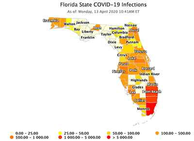

# covidMaps


This project collects national Covid-19 infecxtion statistics and generates state maps with county by county data.  The output is in HTML suitable for integration into a website.

## Installation
### Requirements
  * macOS or Linux (Not tested on Windows)
  
  * Apache2 (configured to support Sites or Virtual Hosts)
  * PHP installed and configured with Apache2
  * Python 3.3+
  * SQLite 3.28+

### 

### Installing

1. Copy the 'scr' and 'www' directories to the location you will run the application from. 

2. Install the following Python modules:
  * requests 2.23.0
  * urllib3 1.25.8

```
     pip3 install requests urllib3
```

3. Determine where to serve the generated maps from.  

&nbsp;&nbsp;&nbsp;&nbsp;&nbsp;&nbsp;On macOS I recommend using the Sites folder.
  * mscOS -Create a symbolic link from the www folder to your Sites folder
```
Sites % ln -s <install root>/www /Users/<userID>/Sites/corona
```

&nbsp;&nbsp;&nbsp;&nbsp;&nbsp;&nbsp;On Linux I found creating a folder off the documentRoot is easiest.
  * Linux - Create a symbolic link from the www folder to the DocumentRoot
```
Sites % ln -s <install root>/www /<DocumentRootDir>/corona
```
End with an example of getting some data out of the system or using it for a little demo

## Running the tests

Explain how to run the automated tests

### Break down into end to end tests

Explain what these tests test and why

```
Give an example
```

### And coding style tests

Explain what these tests test and why

```
Give an example
```

## Deployment

Add additional notes about how to deploy this on a live system

## Built With


## Contributing

Please read [CONTRIBUTING.md](https://gist.github.com/PurpleBooth/b24679402957c63ec426) for details on our code of conduct, and the process for submitting pull requests to us.

## Versioning

We use [SemVer](http://semver.org/) for versioning. For the versions available, see the [tags on this repository](https://github.com/your/project/tags). 

## Authors

* **Tim Porter** 

See also the list of [contributors](https://github.com/your/project/contributors) who participated in this project.

## License

This project is licensed under the MIT License - see the [LICENSE.md](LICENSE.md) file for details

## Acknowledgments

* Hat tip to anyone whose code was used
* Inspiration
* etc
