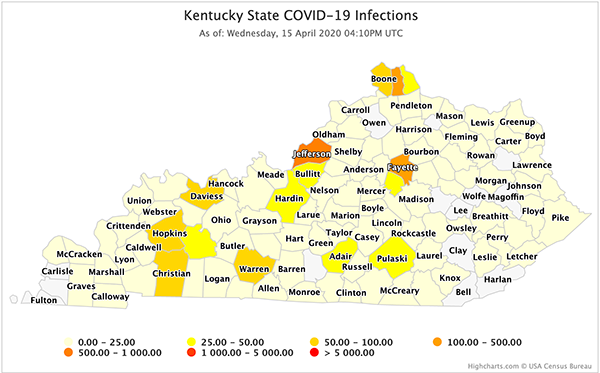

# covidMaps


This project collects national Covid-19 infection statistics and generates state maps with county by county data.  The output is in HTML suitable for integration into a website.

## Installation
### Requirements
  * macOS or Linux (Not tested on Windows)
  
  * Apache2 (configured to support Sites or Virtual Hosts)
  * PHP installed and configured with Apache2
  * Python 3.3+
  * SQLite 3.28+

### 

### Installing

1. Copy the 'scr' and 'www' directories to the location you will run the application from. 

2. Install the following Python modules:
  * requests 2.23.0
  * urllib3 1.25.8

```
     pip3 install requests urllib3
```

3. Determine where to serve the generated maps from.  

&nbsp;&nbsp;&nbsp;&nbsp;&nbsp;&nbsp;On macOS I recommend using the Sites folder.
  * mscOS -Create a symbolic link from the www folder to your Sites folder
```
Sites % ln -s <install root>/www /Users/<userID>/Sites/corona
```

&nbsp;&nbsp;&nbsp;&nbsp;&nbsp;&nbsp;On Linux I found creating a folder off the documentRoot is easiest.
  * Linux - Create a symbolic link from the www folder to the DocumentRoot
```
Sites % ln -s <install root>/www /<DocumentRootDir>/corona
```
You should now be able to browse to http://localhost/~<userID>/corona/ and see the the default index.php page.


## Running the application to generate maps

The clCoronaMap20.py script is located in the src directory.  Running it using Python 3 will generate the individual state maps into the www directory.  
The maps will be visible by browsing to  http://localhost/<userID>/Corona. 

### Testing

Initially I recommend using the Alaska page for testing.  Uncomment the "assemblePage('AK', 'Alaska')" and comment out the three lines following the second '-- For testing' comment
```
    self.locations = self.getCovidLocationData()
    if (os.path.exists(dbFilename)):      # check that the database exists
        self.cn = sqlite3.connect(dbFilename)
        # -- For testing --  uncomment the following line
        #assemblePage('AK', 'Alaska')

        # -- For testing comment out the following three lines
        for stateCode in self.states.keys():
            print(stateCode)
            self.assemblePage(stateCode, self.states[stateCode])
    else:
        print('Error: Cannot find database:', dbFilename)

```

### Time Formatting

Depending on your preference, you can change the formatting of the Date/Time in the map subtitle.  Line 75 of the script displays using 24 hour time format in the first map.  Line 86 displays using 12 hours with AM/PM.  You'll need to determine the appropriate time zone based on your system's time configuration.

```
	104  bodyCode2 += '  subtitle: { text: \'As of: ' + datetime.now().strftime("%A, %d %B %Y %H:%M UTC") + '\' },\n'

	115  bodyCode2 += '  subtitle: { text: \'As of: ' + datetime.now().strftime("%A, %d %B %Y %I:%M%p ET") + '\' },\n'

```

## HighCharts and HighMaps

The map generation uses the HighMaps library.  HighCharts and HighMaps are licensed for non-commercial use - (Non-Profit or personal use)
You can request a Non-Commercial license here - <https://shop.highsoft.com/noncomform>


## Contributing

## Authors

* **Tim Porter** 

See also the list of [contributors](https://github.com/your/project/contributors) who participated in this project.

## License

This project is licensed under the MIT License - see the [LICENSE.md](LICENSE.md) file for details
See HighCharts section above for other licensing requirements.

